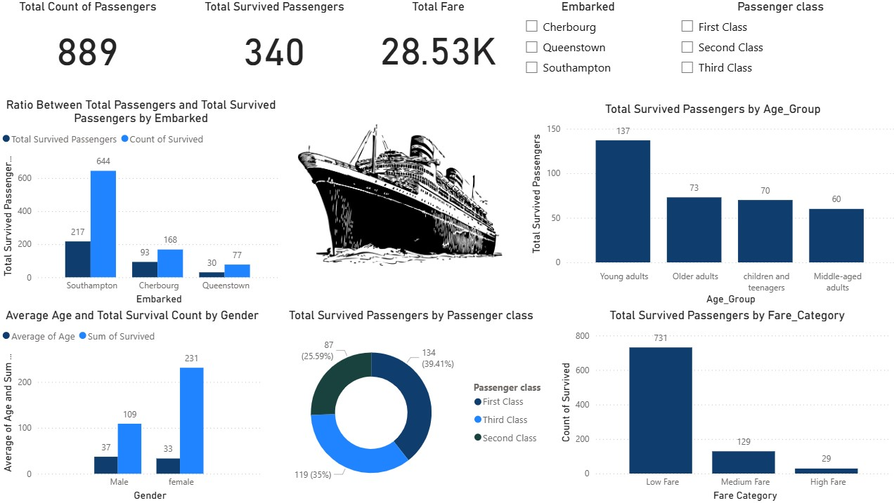

# Titanic Survival Analytics Dashboard

**Comprehensive visualization of Titanic dataset analyzing 889 passengers (340 survived, 38% survival rate), embarkation ports (Southampton dominant), class/gender/age survival patterns, and fare distribution.**

## 🚢 Key Statistics
| Metric | Value |
|--------|-------|
| **Total Passengers** | **889** |
| **Survived** | **340 (38%)** |
| **Top Embarkation** | **Southampton** |

## 📊 Survival Insights
- **1st Class**: 2x higher survival vs. 3rd Class
- **Gender Gap**: Females survived 70%+ vs. males
- **Age Factor**: Children under 10 highest survival

## 🛠️ Tech Stack
- **Power BI** | Survival rate analysis | Categorical breakdowns

## 🚀 Quick Start
1. Download `Titanic-Survival-Analysis.pbix`
2. Open in **Power BI Desktop**
3. Explore the classic dataset!

## 📞 Contact
Have questions about the dashboard or want to collaborate?  
**Email**: Abdelrahman.Gamal.Ai@gmail.com | **LinkedIn**: [linkedin.com/in/yourprofile](https://www.linkedin.com/in/abdelrahman-gamal236/) | **whatsapp**: +201029744194

---
⭐ Star if helpful! 👨‍💻 Built by **[Abdelrahman Gamal]**
